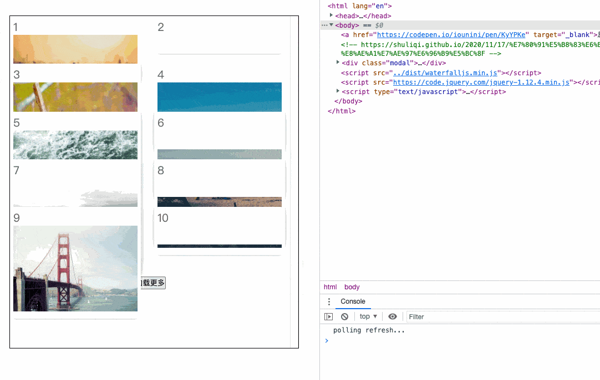

# waterfall-js 原生js实现的瀑布流布局
- 演示图 
- [演示页面](./src//index.html) 
- 核心思路借鉴自 https://codepen.io/iounini/pen/KyYPKe
- 基本实现原理参见: [总结实现瀑布流的三种方式](https://shuliqi.github.io/2020/11/17/%E7%80%91%E5%B8%83%E6%B5%81%E7%9A%84%E5%AE%9E%E7%8E%B0%E6%96%B9%E5%BC%8F)
### 使用方式

1. 直接cdn引入
    ```js
    // 示例代码: https://github.com/hugeorange/waterfalljs/blob/master/src/index.html
    <script src="https://unpkg.com/browse/waterfalljs-layout@latest/dist/waterfalljs-layout.esm.js"></script>
    <script>
        const wf = new Waterfall({
            el: '#waterfall',
            columnWidth: 236,
            gap: 24,
            delay: 800,
            // 自定义样式按需使用
            customStyle: `#waterfall li>div {
                    border-radius: 8px;
                    font-size: 20px;
                    overflow: hidden;
                    color: rgba(0, 0, 0, 0.6);
                    margin-bottom: 20px;
                    padding: 6px;
                    background: rgb(255, 255, 255);
                    box-shadow: 0 3px 10px rgba(0, 0, 0, 0.1);
                    transition: all 0.5s
                }
                #waterfall li>div:hover {
                    transform: translateY(-6px);
                    box-shadow: 0 30px 50px rgba(0, 0, 0, 0.3);
                    transition: all 0.3s
                }
                #waterfall li>div>img {
                    width: 100%
                }`
        })
        // 初始化时执行布局 执行布局
	    wf.init()
        // 加载更多场景时时请调用 
        wf.loadMore()
    ```
2. ESModule 引入
    ```js
    // yarn add waterfalljs-layout

    import waterfalljs from 'waterfalljs-layout'
    const wf = new Waterfall({/** ... */})
    // 初始化
    wf.init()
    // 加载更多时
    wf.loadMore()
    ```

3. 简单粗暴的办法直接拷贝`src/index.ts`目录下的代码到你的项目中使用，vue、react项目均可

---

## API

`option`：

| 选项           | 含义               | 值类型        | 默认值      | 备注 |
| -------------- | ------------------ | ------------- | ----------- | -------------------------- |
| el    | 容器元素id           | string        | #waterfall |容器必须是ul元素|
| columnWidth | 每一列的宽度 | number        | 360        |   |
| columnCount    |多少列         | number   | - | 不传会自动分配   |
| gap    | 每列之间的间隙 | number |    |  500  |
| delay    | 轮询排布的间隔时间 | number        | #waterfall        |   |
| customStyle | 自定义样式 | string | -|   |
| onChangeUlMaxH | 实时获取容器高度 | (h: number) => void  | - |可在上拉加载场景中使用|
