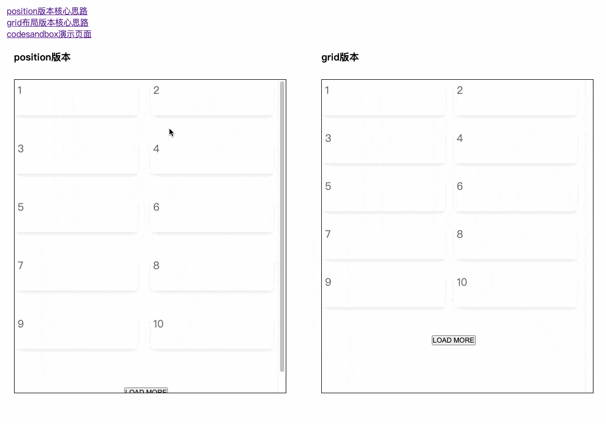

# waterfall-js 瀑布流布局
- 演示图 
- 核心思路借鉴自 [position版本](https://codepen.io/iounini/pen/KyYPKe)、[grid版本](https://juejin.cn/post/6844904004720263176#heading-6)
- [演示页面-index.html](./demo/index.html) 
- [React 版本 codesandbox 演示页面](https://codesandbox.io/s/busy-faraday-w538tc)

### 使用方式

1. 直接cdn引入
    ```js
    // 示例代码: https://github.com/hugeorange/waterfalljs/blob/master/demo/index.html
    <script src="https://unpkg.com/browse/waterfalljs-layout@latest/dist/waterfalljs-layout.min.js"></script>
    <script>
    const wf = Waterfall({
        mode: 'position', // 还有 grid 模式可选
        el: '#waterfall',
        columnWidth: 236, // 每列宽度
        columnGap: 24, // 列间隙
        rowGap: 24, // 行间隙
        delay: 800, // 轮询获取元素高度频率
        // 自定义样式
        customStyle: `#waterfall li>div {
            border-radius: 8px;
            font-size: 20px;
            overflow: hidden;
            color: rgba(0, 0, 0, 0.6);
            padding: 6px;
            background: rgb(255, 255, 255);
            box-shadow: 0 3px 10px rgba(0, 0, 0, 0.1);
            transition: all 0.5s;
          }
          #waterfall li>div:hover {
            transform: translateY(-6px);
            box-shadow: 0 30px 50px rgba(0, 0, 0, 0.3);
            transition: all 0.3s
          }
          #waterfall li>div>img {
            width: 100%
          }`
      })
      // 加载
      wf.load()
    </script>
    ```
2. React 版本
    ```js
    // yarn add waterfalljs-layout
    import Waterfall from "waterfalljs-layout/react";
    // 详细演示页面请参考 
    // 1. https://github.com/hugeorange/waterfalljs/blob/master/demo/react-demo.tsx
    // 2. https://codesandbox.io/s/busy-faraday-w538tc
    <Waterfall
      mode='grid'
      el="#react-waterfall-grid-comps"
      columnWidth={236}
      columnCount={2}
      columnGap={24}
      rowGap={24}
      customStyle={customStyleGrid}
      onChangeUlMaxH={h => (ulMaxHRef.current = h)}
    >
      {images.map((item: any, index) => {
        return (
          <li key={index} onClick={() => alert('图片地址为:' + item)}>
            <div></div>
          </li>
        )
      })}
    </Waterfall>  
    ```

3. 简单粗暴的办法直接拷贝`src/index.ts`目录下的代码到你的项目中使用，vue、react项目均可，或是直接 esmodule 导入 `import Waterfall from "waterfalljs-layout`

---

## API

`option`：

| 选项           | 含义               | 值类型        | 默认值      | 备注 |
| ---- | ---------- | ---- | ----------- | --- |
| el| 容器元素id | string |  |例如：`#waterfall` 容器必须是ul元素，使用react组件不必传此项|
| columnWidth | 每一列的宽度 | number | 360 |  单位px |
| columnCount    |多少列 | number   | - | 不传会自动根据columnWidth分配   |
| columnGap    | 每列之间的间隙 | number | 24   |   单位px|
| rowGap    | 每列之间的间隙 | number |  24  |   单位px|
| delay    | 轮询排布的间隔时间 | number | 500 |单位 ms，轮询获取元素高度的间隔时间|
| customStyle | 自定义样式 | string | -|   |
| onChangeUlMaxH | 实时获取容器高度 | (h: number) => void  | - | 配合在容器中监听 scroll 实现滚动加载功能 |

## 注意事项
- 使用UMD方式时 ==> html元素层级关系必须是 `ul#el>li>div> 自己需展示的内容`
- 使用React版本时 ==> `Children` 必须是 `<li><div>自己需展示的内容</div></li>`
