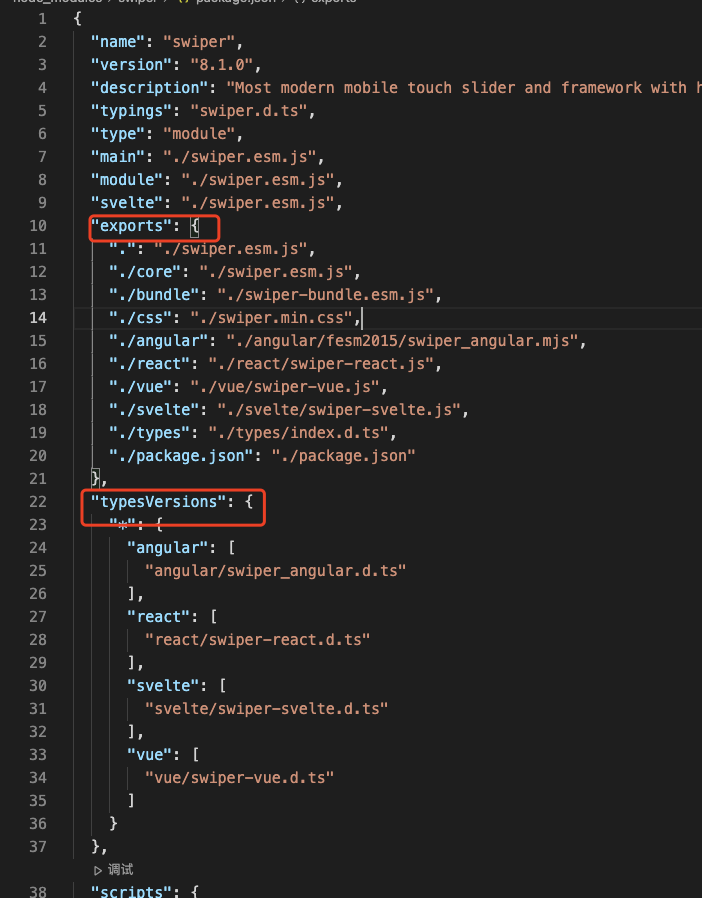

# waterfall-js 瀑布流布局
- 演示图 
- [演示页面](./src//index.html) 
- [React 版本 codesandbox 演示页面](https://codesandbox.io/s/busy-faraday-w538tc)
- 核心思路借鉴自 https://codepen.io/iounini/pen/KyYPKe
- 基本实现原理参见: [总结实现瀑布流的三种方式](https://shuliqi.github.io/2020/11/17/%E7%80%91%E5%B8%83%E6%B5%81%E7%9A%84%E5%AE%9E%E7%8E%B0%E6%96%B9%E5%BC%8F)
### 使用方式

1. 直接cdn引入
    ```js
    // 示例代码: https://github.com/hugeorange/waterfalljs/blob/master/src/index.html
    <script src="https://unpkg.com/browse/waterfalljs-layout@latest/dist/waterfalljs-layout.esm.js"></script>
    <script>
        const wf = new Waterfall({
            el: '#waterfall',
            columnWidth: 236,
            gap: 24,
            delay: 800,
            // 自定义样式按需使用
            customStyle: ''
        })
        // ..................................
        // 初始化数据或加载更多场景时时调用 
        wf.loadMore()
    ```
2. React 版本
    ```js
    // yarn add waterfalljs-layout
    import Waterfall from "waterfalljs-layout/react";
    // 详细演示页面请参考 https://codesandbox.io/s/busy-faraday-w538tc
    <Waterfall
        columnWidth={236}
        columnCount={2}
        gap={24}
        customStyle={customStyle}
        onChangeUlMaxH={(h) => console.log('ul容器高度-->', h)}
      >
        {images.map((item, index) => {
          return (
            <li key={index} >
              <div></div>
            </li>
          );
        })}
      </Waterfall>
    ```

3. 简单粗暴的办法直接拷贝`src/index.ts`目录下的代码到你的项目中使用，vue、react项目均可，或是直接 esmodule 导入 `import Waterfall from "waterfalljs-layout`

---

## API

`option`：

| 选项           | 含义               | 值类型        | 默认值      | 备注 |
| -------------- | ------------------ | ------------- | ----------- | -------------------------- |
| el    | 容器元素id           | string        | #waterfall |容器必须是ul元素，使用react组件不必传此项|
| columnWidth | 每一列的宽度 | number        | 360        |   |
| columnCount    |多少列         | number   | - | 不传会自动分配   |
| gap    | 每列之间的间隙 | number |    |  500  |
| delay    | 轮询排布的间隔时间 | number        | #waterfall        |   |
| customStyle | 自定义样式 | string | -|   |
| onChangeUlMaxH | 实时获取容器高度 | (h: number) => void  | - |可在上拉加载场景中使用|

## rollup 打包遇到的问题
- 采用 rollup 多入口打包，分别打出无框架依赖的核心 js 库，和 react 版本的库 - 配置文件详见 [rollup.config.js](./rollup.config.js)，react 版本本地开发调试配置文件[rollup.config.react-dev.js](./rollup.config.react-dev.js)
- 为了方便 核心 js库 引用及 react 版本没有区分目录，统一放在 src 根目录下，ts 自动生成 `.d.ts` 会根据文件名自动生成一个目录(并且会为所有文件生成 `.d.ts`) 如下图所示

- package.json 怎么定义导出两个包，参考自 `swiper` 的定义方式 [Node.JS（新）Package.json exports 字段](https://www.cnblogs.com/taohuaya/p/15573719.html)
- swiper 定义方式 
- [ ] TODO: rollup react开发环境无法加载node_module里面的包
