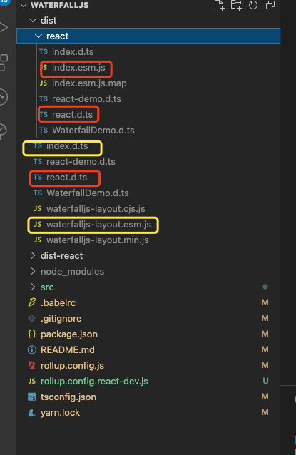
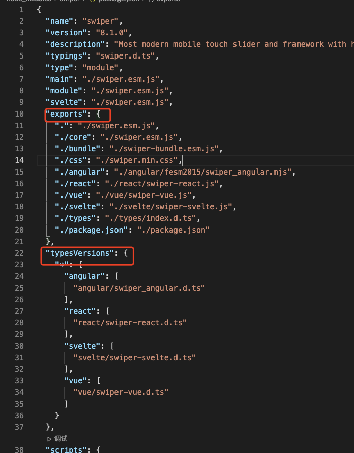

## rollup 打包遇到的问题
- 采用 rollup 多入口打包，分别打出无框架依赖的核心 js 库，和 react 版本的库 - 配置文件详见 [rollup.config.js](./rollup.config.js)，react 版本本地开发调试配置文件[rollup.config.react-dev.js](./rollup.config.react-dev.js)
- 为了方便 核心 js库 引用及 react 版本没有区分目录，统一放在 src 根目录下，ts 自动生成 `.d.ts` 会根据文件名自动生成一个目录(并且会为所有文件生成 `.d.ts`) 如下图所示

- package.json 怎么定义导出两个包，参考自 `swiper` 的定义方式 [Node.JS（新）Package.json exports 字段](https://www.cnblogs.com/taohuaya/p/15573719.html)
- swiper 定义方式 
- [ ] TODO: rollup react开发环境无法加载node_module里面的包
